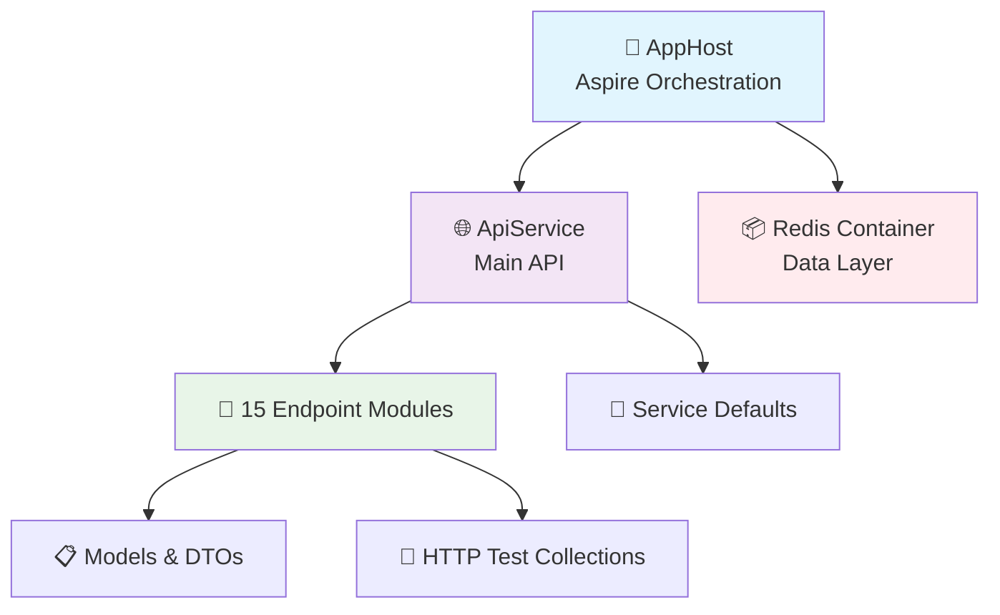
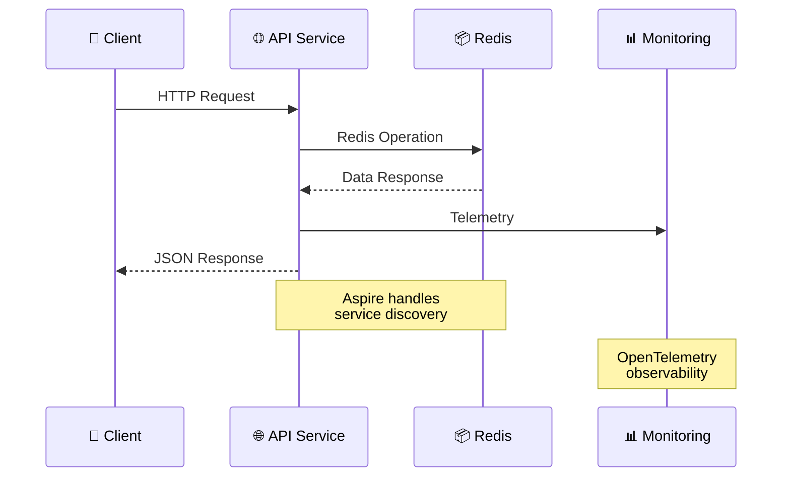
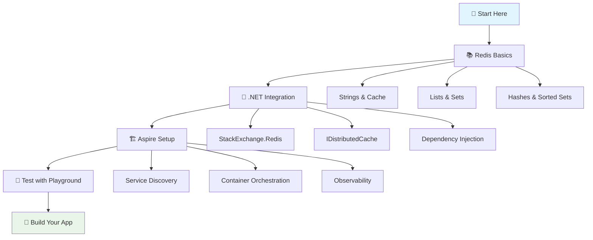

<div align="center">

# 🚀 Redis Playground

### *A Modern .NET 9 Redis Operations Showcase*

[](https://dotnet.microsoft.com/)
[](https://redis.io/)
[](https://learn.microsoft.com/en-us/dotnet/aspire/)
[](https://www.docker.com/)

**Comprehensive Redis operations demonstration with clean architecture, Microsoft Aspire orchestration, and modern .NET patterns**

---

</div>

## 📋 Navigation

<details>
<summary><strong>🗂️ Table of Contents</strong></summary>

- [✨ Overview](#-overview)
- [🏗️ Architecture](#️-architecture)  
- [⚡ Quick Start](#-quick-start)
- [📖 API Reference](#-api-reference)
- [🧪 Testing](#-testing)
- [⚙️ Configuration](#️-configuration)
- [📚 Resources](#-resources)

</details>

## ✨ Overview

> **Redis Playground** showcases **15 comprehensive Redis feature groups** through a clean, modular ASP.NET Core API built with modern .NET patterns and cloud-native principles.

<table>
<tr>
<td>

### 🏗️ **Technology Stack**

| Component | Technology |
|-----------|------------|
| **Runtime** | `.NET 9` with Minimal APIs |
| **Orchestration** | `Microsoft Aspire` |
| **Redis Client** | `StackExchange.Redis` |
| **Documentation** | `OpenAPI/Swagger` |
| **Architecture** | `Clean Architecture` |

</td>
<td>

### 📦 **Feature Categories**

| 🎯 **Category** | 📊 **Features** |
|----------------|------------------|
| **Core** | Cache, Strings, Collections |
| **Real-time** | Pub/Sub, Streams |
| **Spatial** | Geospatial Operations |
| **Modern** | JSON, Analytics, ML |
| **Tools** | Locks, Utilities, DevOps |

</td>
</tr>
</table>

### 🌟 **Project Architecture**



<details>
<summary><strong>📁 Detailed Project Structure</strong></summary>

```
🏗️ RedisPlayground/
├── 🎯 RedisPlayground.AppHost/           # Aspire orchestration & service discovery
├── 🌐 RedisPlayground.ApiService/        # Core API service
│   ├── 📂 Endpoints/                     # 15 feature-specific modules
│   │   ├── 01-BasicCacheEndpoints.cs     # IDistributedCache operations
│   │   ├── 02-StringEndpoints.cs         # String & counter operations
│   │   ├── 03-HashEndpoints.cs          # Hash/dictionary operations
│   │   ├── 04-ListEndpoints.cs          # Queue & stack operations
│   │   ├── 05-SetEndpoints.cs           # Set operations & membership
│   │   ├── 06-SortedSetEndpoints.cs     # Leaderboards & rankings
│   │   ├── 07-PubSubEndpoints.cs        # Real-time messaging
│   │   ├── 08-StreamEndpoints.cs        # Event streaming
│   │   ├── 09-GeospatialEndpoints.cs    # Location services
│   │   ├── 11-JsonEndpoints.cs          # JSON document operations
│   │   ├── 12-BitfieldEndpoints.cs      # Bit manipulation
│   │   ├── 13-LockEndpoints.cs          # Distributed locking
│   │   ├── 14-AnalyticsEndpoints.cs     # Bloom filters & analytics
│   │   └── 15-DeveloperToolsEndpoints.cs # Dev utilities & diagnostics
│   ├── 📋 Models/                        # Request/response DTOs
│   ├── 🔧 Extensions/                    # Endpoint registration
│   └── 🧪 HttpTests/                     # Comprehensive test collections
├── ⚙️ RedisPlayground.ServiceDefaults/   # Shared configuration & middleware
└── 📄 RedisPlayground.sln               # Solution file
```

</details>

## 🏗️ Architecture

### 🎯 **Redis Feature Matrix**

<div align="center">

| 🔥 **Category** | 📊 **Features** | 💡 **Use Cases** | 🎨 **Examples** |
|-----------------|------------------|-------------------|------------------|
| **🔧 Basic** | Cache, Strings | Session storage, counters | User sessions, page views |
| **📚 Collections** | Lists, Sets, Sorted Sets, Hashes | Queues, leaderboards, profiles | Gaming scores, social feeds |
| **⚡ Advanced** | Pub/Sub, Streams, Geospatial | Real-time messaging, location | Chat apps, delivery tracking |
| **🚀 Modern** | JSON, Bitfields, Analytics | Document storage, ML features | Content management, recommendations |
| **🛠️ Tools** | Locks, Rate Limiting, DevOps | Distributed systems, monitoring | API protection, diagnostics |

</div>

### 🌊 **Data Flow Architecture**



## ⚡ Quick Start

### 📋 **Prerequisites**

<table>
<tr>
<td width="50%">

#### ✅ **Required**
- 🔧 `.NET 9 SDK` 
- 🐳 `Docker Desktop`
- 💻 `Git` (for cloning)

</td>
<td width="50%">

#### 🌟 **Recommended**
- 🎨 `VS Code` with REST Client
- 🔍 `Redis CLI` tools
- 📊 `Aspire Dashboard` browser

</td>
</tr>
</table>

---

### 🚀 **Option 1: Aspire Orchestration** *(Recommended)*

```bash
# 🎯 One-command startup with full observability
git clone https://github.com/fkucukkara/RedisPlayground.git
cd RedisPlayground
dotnet run --project RedisPlayground.AppHost
```

<div align="center">

#### 🌐 **Access Points**

| � **Service** | 🌍 **URL** | 📝 **Description** |
|----------------|------------|---------------------|
| **🎛️ Aspire Dashboard** | http://localhost:15000 | Service orchestration & monitoring |
| **📖 API Documentation** | *Check dashboard for URL* + `/swagger` | Interactive OpenAPI docs |
| **🧪 HTTP Test Files** | VS Code → `HttpTests/*.http` | Ready-to-run API tests |

</div>

---

### ⚙️ **Option 2: Manual Setup** *(Development)*

<details>
<summary><strong>🔧 Click to expand manual setup instructions</strong></summary>

```bash
# 🐳 Start Redis container
docker run -d -p 6379:6379 --name redis-playground redis:latest

# 🌐 Run API service directly
dotnet run --project RedisPlayground.ApiService
```

**📍 Manual Access:** API available at `http://localhost:5528`

</details>

---

### ✨ **Quick Validation**

Run this quick test to verify everything is working:

```bash
# 🧪 Test basic cache operation
curl -X POST "http://localhost:5528/cache/hello" \
  -H "Content-Type: application/json" \
  -d '"World"'

# 🔍 Retrieve cached value  
curl "http://localhost:5528/cache/hello"
```

**Expected Response:** `"World"`

## 📖 API Reference

### 🔧 **Core Operations**

<details>
<summary><strong>📦 Basic Cache & Strings</strong></summary>

```http
# 🗄️ Distributed Cache (IDistributedCache)
GET    /cache/{key}                    # Retrieve cached value
POST   /cache/{key}                    # Store with 5min TTL  
DELETE /cache/{key}                    # Remove from cache

# 🔤 String Operations & Counters
GET    /strings/{key}                  # Get string value
POST   /strings/{key}                  # Set string value
POST   /strings/{key}/increment        # Atomic increment/decrement
GET    /strings/{key}/length           # Get string length
```

</details>

<details>
<summary><strong>📚 Collections & Data Structures</strong></summary>

```http
# 🗂️ Hash Operations (Key-Value maps)
GET    /hashes/{key}                   # Get all hash fields
POST   /hashes/{key}/{field}           # Set hash field
GET    /hashes/{key}/{field}           # Get specific field

# 📝 List Operations (Queues & Stacks)  
GET    /lists/{key}                    # Get list range
POST   /lists/{key}/push               # Push to list
POST   /lists/{key}/pop                # Pop from list

# 🎯 Set Operations (Unique collections)
GET    /sets/{key}                     # Get set members
POST   /sets/{key}/add                 # Add to set
POST   /sets/{key}/union               # Set union operation

# 🏆 Sorted Set Operations (Leaderboards)
GET    /sorted-sets/{key}/leaderboard  # Get rankings by score
POST   /sorted-sets/{key}/add          # Add scored member
GET    /sorted-sets/{key}/rank/{member} # Get member rank
```

</details>

### 🚀 **Advanced Features**

<details>
<summary><strong>⚡ Real-time & Streaming</strong></summary>

```http
# 📡 Pub/Sub Messaging
POST   /pubsub/publish/{channel}       # Publish message to channel
GET    /pubsub/subscribe/{channel}     # Subscribe to channel (SSE)
GET    /pubsub/channels                # List active channels

# 🌊 Redis Streams (Event sourcing)
POST   /streams/{stream}/add           # Add entry to stream
GET    /streams/{stream}/read          # Read stream entries
POST   /streams/{stream}/group/create  # Create consumer group
```

</details>

<details>
<summary><strong>🌍 Location & Spatial</strong></summary>

```http
# 📍 Geospatial Operations
POST   /geo/{key}/add                  # Add location with coordinates
GET    /geo/{key}/radius               # Find points within radius
GET    /geo/{key}/distance             # Calculate distance between points
GET    /geo/{key}/nearby               # Get nearby locations
```

</details>

<details>
<summary><strong>🚀 Modern Redis Stack</strong></summary>

```http
# 📄 JSON Document Operations
GET    /json/{key}                     # Get JSON document
POST   /json/{key}/set                 # Set JSON document
POST   /json/{key}/path                # JSONPath operations
GET    /json/{key}/keys                # Get document keys

# 🔬 Analytics & Probabilistic Data
POST   /analytics/bloom/{key}/add      # Bloom filter operations
GET    /analytics/bloom/{key}/check    # Check bloom filter membership
POST   /analytics/hyperloglog/{key}/add # HyperLogLog cardinality
```

</details>

### 🛠️ **Developer Tools**

<details>
<summary><strong>🔧 Utilities & Diagnostics</strong></summary>

```http
# 🎲 Sample Data Generation
POST   /devtools/sample-data/generate  # Create comprehensive test data
POST   /devtools/sample-data/users     # Generate user profiles
POST   /devtools/sample-data/leaderboard # Generate gaming leaderboard

# 🗃️ Database Management
DELETE /devtools/keys/pattern          # Bulk delete by pattern
GET    /devtools/keys/info             # Database statistics & memory usage
GET    /devtools/keys/scan             # Scan keys by pattern
POST   /devtools/backup               # Create data backup

# 🔍 Direct Redis Access
POST   /devtools/command              # Execute raw Redis commands
GET    /devtools/config               # Get Redis configuration
POST   /devtools/monitor              # Monitor Redis commands (real-time)
```

</details>

---

### 📱 **Response Examples**

<details>
<summary><strong>💡 Click to see sample API responses</strong></summary>

```json
// GET /sorted-sets/leaderboard/top
{
  "success": true,
  "data": [
    {"member": "player1", "score": 2500.0, "rank": 1},
    {"member": "player2", "score": 2350.0, "rank": 2},
    {"member": "player3", "score": 2100.0, "rank": 3}
  ],
  "metadata": {
    "totalMembers": 150,
    "timestamp": "2025-08-30T10:30:00Z"
  }
}

// GET /geo/stores/nearby  
{
  "success": true,
  "data": [
    {
      "name": "Store A",
      "distance": "0.8 km",
      "coordinates": [40.7589, -73.9851]
    }
  ]
}
```

</details>

## 🧪 Testing

### 🎯 **Interactive Testing with HTTP Files**

<div align="center">

| 📝 **Step** | 🎯 **Action** | 💡 **Details** |
|-------------|---------------|----------------|
| **1** | Install **REST Client** extension | VS Code marketplace |
| **2** | Open any `.http` file in `HttpTests/` | 15 comprehensive test collections |
| **3** | Click **"Send Request"** | Above any HTTP request |
| **4** | View responses | In adjacent panel |

</div>

---

### 🎲 **Sample Data Generation**

<details>
<summary><strong>🏗️ Generate Comprehensive Test Data</strong></summary>

```bash
# 🎯 Generate complete dataset (all Redis types)
curl -X POST "http://localhost:5528/devtools/sample-data/generate" \
  -H "Content-Type: application/json" \
  -d '{
    "keyPrefix": "demo", 
    "count": 50,
    "includeUsers": true,
    "includeLeaderboard": true,
    "includeGeoData": true
  }'
```

**🎉 This creates:**
- ✅ **Cache entries** - Session-like data
- ✅ **String counters** - Page views, likes  
- ✅ **Hash profiles** - User information
- ✅ **List queues** - Message queues
- ✅ **Set collections** - Tags, categories
- ✅ **Sorted leaderboards** - Gaming scores
- ✅ **Geospatial data** - Store locations
- ✅ **JSON documents** - Product catalogs
- ✅ **Stream events** - Activity logs

</details>

---

### 🧹 **Data Management**

<details>
<summary><strong>🗑️ Cleanup & Reset Operations</strong></summary>

```bash
# 🧹 Clean up test data by pattern
curl -X DELETE "http://localhost:5528/devtools/keys/pattern" \
  -H "Content-Type: application/json" \
  -d '{"pattern": "demo:*"}'

# 📊 Check database statistics
curl "http://localhost:5528/devtools/keys/info"

# 🔍 Scan for specific patterns
curl "http://localhost:5528/devtools/keys/scan?pattern=user:*&count=10"
```

</details>

---

### 🎮 **Example Test Scenarios**

<details>
<summary><strong>🏆 Gaming Leaderboard Test</strong></summary>

```bash
# 1️⃣ Add players to leaderboard
curl -X POST "http://localhost:5528/sorted-sets/game-scores/add" \
  -H "Content-Type: application/json" \
  -d '{"member": "player1", "score": 2500}'

# 2️⃣ Get top 10 players  
curl "http://localhost:5528/sorted-sets/game-scores/leaderboard?count=10"

# 3️⃣ Get player rank
curl "http://localhost:5528/sorted-sets/game-scores/rank/player1"
```

</details>

<details>
<summary><strong>📍 Location Services Test</strong></summary>

```bash
# 1️⃣ Add store locations
curl -X POST "http://localhost:5528/geo/stores/add" \
  -H "Content-Type: application/json" \
  -d '{
    "member": "store1", 
    "longitude": -73.9851, 
    "latitude": 40.7589
  }'

# 2️⃣ Find nearby stores (within 5km)
curl "http://localhost:5528/geo/stores/radius?longitude=-73.9800&latitude=40.7500&radius=5&unit=km"
```

</details>

<details>
<summary><strong>💬 Real-time Messaging Test</strong></summary>

```bash
# 1️⃣ Publish message to channel
curl -X POST "http://localhost:5528/pubsub/publish/chat-room" \
  -H "Content-Type: application/json" \
  -d '{"message": "Hello, Redis!", "user": "demo-user"}'

# 2️⃣ Subscribe to channel (Server-Sent Events)
curl "http://localhost:5528/pubsub/subscribe/chat-room"
```

</details>

## ⚙️ Configuration

### 🎯 **Aspire Integration** *(Recommended)*

<details>
<summary><strong>🔧 Automatic Service Discovery & Orchestration</strong></summary>

```csharp
// AppHost.cs - Zero-configuration Redis setup
var builder = DistributedApplication.CreateBuilder(args);

// 🐳 Automatic Redis container provisioning
var redis = builder.AddRedis("cache")
    .WithRedisCommander(); // Optional: Redis GUI

// 🌐 API service with automatic Redis connection
var apiService = builder.AddProject<Projects.RedisPlayground_ApiService>("apiservice")
    .WithReference(redis)         // Service discovery
    .WithReplicas(2);            // Load balancing

// 🎛️ Aspire dashboard with full observability
builder.Build().Run();
```

**✨ Benefits:**
- 🔄 Automatic service discovery
- 📊 Built-in observability & metrics  
- 🐳 Container lifecycle management
- 🔧 Configuration management
- 🚀 Zero manual setup required

</details>

---

### ⚙️ **Manual Configuration** *(Development)*

<details>
<summary><strong>🔧 Traditional Connection Setup</strong></summary>

#### **📁 appsettings.json**
```json
{
  "ConnectionStrings": {
    "cache": "localhost:6379"
  },
  "Redis": {
    "Configuration": {
      "AbortOnConnectFail": false,
      "ConnectTimeout": 5000,
      "SyncTimeout": 5000,
      "AsyncTimeout": 5000,
      "ConnectRetry": 3,
      "KeepAlive": 180
    }
  },
  "Logging": {
    "LogLevel": {
      "Default": "Information",
      "StackExchange.Redis": "Warning"
    }
  }
}
```

#### **🔧 Program.cs Service Registration**
```csharp
// Manual Redis registration (without Aspire)
builder.Services.AddStackExchangeRedisCache(options =>
{
    options.Configuration = builder.Configuration.GetConnectionString("cache");
    options.InstanceName = "RedisPlayground";
});

// Direct StackExchange.Redis registration
builder.Services.AddSingleton<IConnectionMultiplexer>(provider =>
{
    var connectionString = builder.Configuration.GetConnectionString("cache");
    return ConnectionMultiplexer.Connect(connectionString);
});
```

</details>

---

### 🐳 **Docker Compose Setup** *(Alternative)*

<details>
<summary><strong>🏗️ Container Orchestration without Aspire</strong></summary>

```yaml
# docker-compose.yml
version: '3.8'

services:
  redis:
    image: redis:7-alpine
    ports:
      - "6379:6379"
    command: redis-server --appendonly yes
    volumes:
      - redis-data:/data
    healthcheck:
      test: ["CMD", "redis-cli", "ping"]
      interval: 10s
      timeout: 3s
      retries: 3

  redis-commander:
    image: rediscommander/redis-commander:latest
    ports:
      - "8081:8081"
    environment:
      - REDIS_HOSTS=local:redis:6379
    depends_on:
      - redis

  api:
    build: .
    ports:
      - "5528:8080"
    environment:
      - ConnectionStrings__cache=redis:6379
    depends_on:
      - redis

volumes:
  redis-data:
```

**🚀 Start with:** `docker-compose up -d`

</details>

---

### 🌍 **Environment Variables**

| 🔧 **Variable** | 📝 **Description** | 🎯 **Default** |
|-----------------|--------------------|-----------------| 
| `ConnectionStrings__cache` | Redis connection string | `localhost:6379` |
| `ASPNETCORE_ENVIRONMENT` | Runtime environment | `Development` |
| `Redis__InstanceName` | Redis instance identifier | `RedisPlayground` |
| `OTEL_EXPORTER_OTLP_ENDPOINT` | OpenTelemetry endpoint | *(disabled)* |

## 📚 Resources

### � **Official Documentation**

<table>
<tr>
<td width="50%">

#### 📖 **Redis Resources**
- 🎯 **[Redis Data Types Overview](https://redis.io/docs/latest/develop/data-types/)**  
  *Complete guide to all Redis data structures*
  - **Basic Types**: Strings, Lists, Sets, Hashes, Sorted Sets
  - **Advanced Types**: Streams, Geospatial, Bitmaps, Bitfields  
  - **Modern Features**: JSON documents, Vector sets (AI/ML)
  - **Probabilistic**: HyperLogLog, Bloom filters, t-digest, Count-min sketch
  - **Time Series**: Specialized timestamped data structures

- 🚀 **[Redis Commands Reference](https://redis.io/commands/)**  
  *Comprehensive command documentation*

- 🎓 **[Redis University](https://university.redis.com/)**  
  *Free courses and certifications*

</td>
<td width="50%">

#### 🏗️ **.NET Aspire Resources**
- 🌟 **[.NET Aspire Integrations Overview](https://learn.microsoft.com/en-us/dotnet/aspire/fundamentals/integrations-overview)**  
  *Cloud-native development platform*
  - **Hosting Integrations**: Container & cloud resource provisioning
  - **Client Integrations**: DI, health checks, telemetry automation
  - **Redis Packages**:
    - `Aspire.StackExchange.Redis` - Core operations
    - `Aspire.StackExchange.Redis.DistributedCaching` - IDistributedCache
    - `Aspire.StackExchange.Redis.OutputCaching` - Response caching
  - **Service Defaults**: Observability, health, resiliency patterns

- 🎯 **[Aspire Dashboard](https://learn.microsoft.com/en-us/dotnet/aspire/fundamentals/dashboard/overview)**  
  *Observability & monitoring*

</td>
</tr>
</table>

---

### 🛠️ **Developer Tools & Extensions**

<details>
<summary><strong>🎨 Recommended VS Code Extensions</strong></summary>

| 🔧 **Extension** | 📝 **Purpose** | 🎯 **Usage** |
|------------------|----------------|---------------|
| **REST Client** | HTTP testing | Test `.http` files directly in VS Code |
| **C# Dev Kit** | .NET development | IntelliSense, debugging, project management |
| **Docker** | Container management | Manage Redis containers |
| **Thunder Client** | API testing | Alternative to Postman |
| **GitLens** | Git integration | Enhanced git capabilities |

</details>

<details>
<summary><strong>🔍 Redis GUI Tools</strong></summary>

| 🎨 **Tool** | 🌟 **Features** | 💰 **Cost** |
|-------------|------------------|--------------|
| **Redis Commander** | Web-based, simple interface | Free |
| **RedisInsight** | Official Redis GUI, advanced features | Free |
| **Medis** | macOS native app | Free |
| **Redis Desktop Manager** | Cross-platform, feature-rich | Paid |

</details>

---

### 🎓 **Learning Path**

<div align="center">



</div>

---

### 🤝 **Community & Support**

<div align="center">

| 🌐 **Platform** | 🎯 **Purpose** | 🔗 **Link** |
|------------------|----------------|-------------|
| **GitHub Issues** | Bug reports, feature requests | [Create Issue](https://github.com/fkucukkara/RedisPlayground/issues) |
| **Discussions** | Questions, ideas, showcases | [Join Discussion](https://github.com/fkucukkara/RedisPlayground/discussions) |
| **Redis Community** | Redis-specific help | [Redis Discord](https://discord.gg/redis) |
| **.NET Community** | .NET & Aspire support | [.NET Discord](https://discord.gg/dotnet) |

</div>

---

<div align="center">

### 🌟 **Star this repo if it helped you!**

[](https://github.com/fkucukkara/RedisPlayground/stargazers)
[](https://github.com/fkucukkara/RedisPlayground/network)

**Made with ❤️ for the .NET & Redis communities**

---

*📝 Want to contribute? Check our [Contributing Guidelines](CONTRIBUTING.md) | 📄 [MIT License](LICENSE)*

</div>
